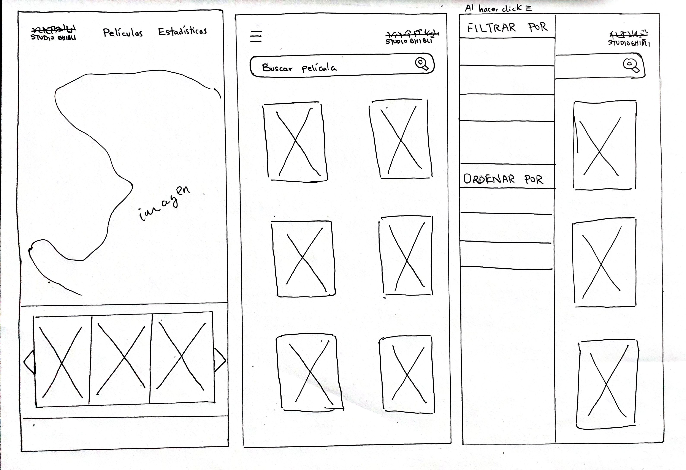
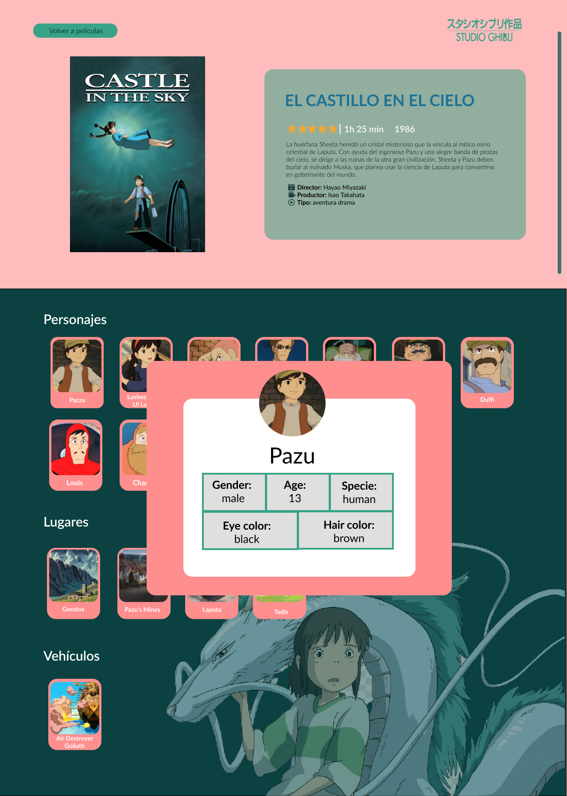

# Data Lovers – Studio Ghibli

## 1. Resumen del proyecto 📝

Este proyecto tiene como finalidad **construir una página web responsive**, dirigido a personas que les gusta el cine, en especial el animado, y quieren estar más informados sobre las películas de Studio Ghibli. Por lo que, se podrá `visualizar` de manera precisa y clara información de todas las películas, contando con información relevente como el año de su estreno, su descripción, el director, productor, personajes, locaciones y vehículos. Toda esta información puede ser manejada por los usuarios, de tal manera que puedan `filtrarla` y `ordenarla` según diversas especificaciones.

## 2. Descripción del proyecto 📎

### ¿Quiénes son los principales usuarios?
Desde fans del cine animado hasta adultos, jóvenes y niños que crecieron viendo la películas de Studio Ghibli, que no recuerdan el nombre específico de las peliculas para volverlas a ver o encontrar información detallada.
### ¿Cuáles son los objetivos de los usuarios en relación con esta página?
Que las personas de cualquier edad puedan acceder a la información detallada de las películas del Studio Ghibli.
### ¿Cómo esta página está resolviendo los problemas de los usuarios?
Filtrando, ordenando y buscando la información detallada de cada película según sus diversas necesidades de los usuarios.

### 2.1 Proceso Creativo de Diseño 👩🏻‍🎨🎨

* Estilo

Para el proyecto se optó por la temática de una de las películas de Studio Ghibli, El viaje de Chihiro, ya que vimos el buen contraste de colores que nos permitiría transmitir la información de forma clara y precisa, y que a su vez pueda ser amigable ante la vista de nuestros usuarios, asi ellos puedan tener un rápido reconocimiento de la interfaz de nuestra pagina web.

* Prototipo de baja fidelidad

Estos dos prototipos fueron realizados a mano para tener una idea de la estructura.

Esta sería la vista para celulares:

Esta sería la vista para desktop:

* Prototipo de alta fidelidad

Estos dos prototipos fueron realizados en Figma para aplicar los colores y temática previamente pensados.

Esta sería la vista para desktop:

Esta sería la vista para celulares:

### 2.2  Historias de Usuario y Criterios de Aceptación 📢 📝

> HU 1:  🗣️ Yo COMO fan del cine QUIERO ver las portadas de las películas populares de studio ghibli PARA identificar una película que vi y olvide.

 📍 **Criterios de Aceptación:**
- Obtener la buena posición de nuestra imagen de Portada(formato svg).
- Darle buena funcionalidad a nuestro carrusel de portadas de películas populares.

> HU 2:  🗣️ Yo COMO usuario QUIERO ver más películas que estén etiquetadas por año y puntaje PARA poder ver más información de más películas.

 📍 **Criterios de Aceptación:**
- Tener lo botones de búsqueda, Filter By y Sort By.
- Mostrar los posters de las películas en bloque.
- Ponerle la información(Año y puntaje) de la película sobre su poster.

> HU 3:  🗣️ Yo COMO usuario QUIERO ordenar de forma ascendente/descendente PARA guiarme de manera más rápida y verlo de manera cronológica.

 📍 **Criterios de Aceptación:**
- Contar con un selector llamado "Sort By" que contiene las opciones del ordenamiento seleccionado por el usuario.
- Testear la función sort y cumplir con los mínimos requerimientos para los test.

> HU 4:  🗣️ Yo COMO usuario QUIERO filtrar las pelicular por nombre de productor o director PARA estar al tanto de qué películas produjeron.

 📍 **Criterios de Aceptación:**
- Contar con un selector llamado "Filter By" que contiene las opciones de filtrado por director/productor seleccionado por el usuario.
- Testear la función filter y cumplir con los mínimos requerimientos para los test.

> HU 5:  🗣️ Yo COMO usuario QUIERO buscar una película por su nombre PARA ver su información.

 📍 **Criterios de Aceptación:**
- El usuario al ingresar por el teclado va buscando y cuando borra reaparece todos los posters.
- Testear la función search y cumplir con los mínimos requerimientos para los test.

> HU 6:  🗣️ Yo COMO usuario QUIERO buscar una película por su nombre PARA ver su información.

 📍 **Criterios de Aceptación:**

##  3. Consideraciones Generales 🚨

- 📍 Este proyecto se realizó en dupla.

- 📍 La interfaz del proyecto será desplegada usando GitHub Pages.

- 📍 El tiempo del proyecto fue de `- semanas.`

##  4. Pruebas Unitarias 📝💯

Para las pruebas Unitarias `(tests)`, creamos nuestras propias funciones, así como la configuración necesaria para ejecutar los tests usando el comando `npm test`. Logrando superar la cobertura mínima del **70%** de statements, functions y lines, y un mínimo del **50%** de branches.

## 5. Objetivos de aprendizaje

### HTML

- [ ] **Uso de HTML semántico**

### CSS

- [ ] **Uso de selectores de CSS**

- [ ] **Modelo de caja (box model): borde, margen, padding**

- [ ] **Uso de flexbox en CSS**

### Web APIs

- [ ] **Uso de selectores del DOM**

- [ ] **Manejo de eventos del DOM (listeners, propagación, delegación)**

- [ ] **Manipulación dinámica del DOM**

### JavaScript

- [ ] **Diferenciar entre tipos de datos primitivos y no primitivos**

- [ ] **Arrays (arreglos)**

- [ ] **Objetos (key, value)**

- [ ] **Variables (declaración, asignación, ámbito)**

- [ ] **Uso de condicionales (if-else, switch, operador ternario, lógica booleana)**

- [ ] **Uso de bucles/ciclos (while, for, for..of)**

- [ ] **Funciones (params, args, return)**

- [ ] **Pruebas unitarias (unit tests)**

- [ ] **Módulos de ECMAScript (ES Modules)**

- [ ] **Uso de linter (ESLINT)**

- [ ] **Uso de identificadores descriptivos (Nomenclatura y Semántica)**

- [ ] **Diferenciar entre expresiones (expressions) y sentencias (statements)**

### Control de Versiones (Git y GitHub)

- [ ] **Git: Instalación y configuración**

- [ ] **Git: Control de versiones con git (init, clone, add, commit, status, push, pull, remote)**

- [ ] **Git: Integración de cambios entre ramas (branch, checkout, fetch, merge, reset, rebase, tag)**

- [ ] **GitHub: Creación de cuenta y repos, configuración de llaves SSH**

- [ ] **GitHub: Despliegue con GitHub Pages**

- [ ] **GitHub: Colaboración en Github (branches | forks | pull requests | code review | tags)**

### UX (User eXperience)

- [ ] **Diseñar la aplicación pensando en y entendiendo al usuario**

- [ ] **Crear prototipos para obtener feedback e iterar**

- [ ] **Aplicar los principios de diseño visual (contraste, alineación, jerarquía)**

- [ ] **Planear y ejecutar tests de usabilidad**
